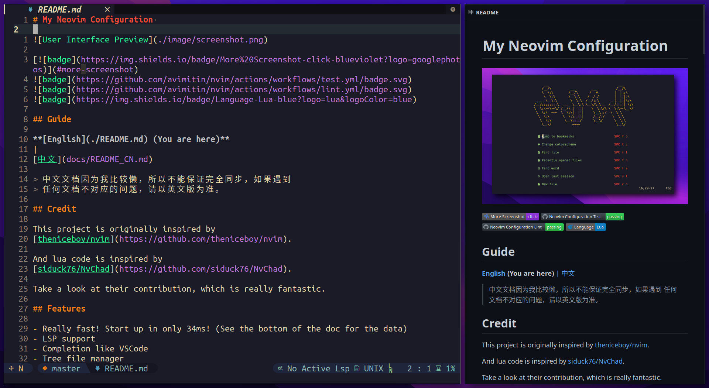

# My Neovim Configuration 


---

 

---

 

## Guide

**[English](./README.md) (You are here)**
|
[中文](docs/README_CN.md)

> 中文文档因为我比较懒，所以不能保证完全同步，如果遇到
> 任何文档不对应的问题，请以英文版为准。

## Credit

This project is originally inspired by
[theniceboy/nvim](https://github.com/theniceboy/nvim).

And lua code is inspired by
[siduck76/NvChad](https://github.com/siduck76/NvChad).

Take a look at their contribution, which is really fantastic.

## Features

- Really fast! Start up in only 43ms! (See the bottom of the doc for the data)
- LSP support
- Completion like VSCode
- Tree file manager
- Symbols explorer
- Buffer line manager
- Fuzzy file/text/image finder
- Floating terminal and REPL support
- Handy git tools
- Motion on speed
- Markdown preview and snippet
- Optimized Rust, C++, Golang, Lua coding experience

## Installation

To keep your customization, fork the configuration and clone
your repository URL instead of mine. Everyone should build their
own neovim configuration in my opinion.

```bash
# linux or mac user
git clone https://github.com/Avimitin/nvim ~/.config/nvim

# Bootstrap
nvim -c 'autocmd User PackerComplete quitall'
```

### Docker

Just wanna have some fun but do not want to mess up your local environment?
I have docker script for you!

```bash
docker run -w /root -it --rm alpine:edge sh -uelic '
      apk add git neovim ripgrep alpine-sdk --update
      git clone https://github.com/Avimitin/nvim ~/.config/nvim
      nvim -c "autocmd User PackerComplete quitall"
      nvim /root/.config/nvim/README.md
  '
```

## Dependency

### neovim

> `IMPORTANT NOTES`: I'am using the pure Lua configuration so you 
> must use the latest built of the neovim.
>
> you will need at least `NVIM v0.5.0-dev+1411-gb28d458f8`.

- Linux

```bash
# if you are an Ubuntu user
# removed out of dated version
sudo apt remove neovim
sudo add-apt-repository ppa:neovim-ppa/unstable
sudo apt-get update
sudo apt install neovim

# OR if you are a Arch user
yay -S neovim-git
```

### Install nerdfont

It's highly recommended to install [nerdfont](https://www.nerdfonts.com/font-downloads) 
for impressive icon support.

### Check health

Open your neovim and input following command to check if the dependence is all installed or not.

```vim
:checkhealth
```
## Details about my configuration

See [addtional](./docs/addtional.md)

## License

MIT License

## Start up time test data

```text
# Open only buffer
# nvim --startuptime /tmp/nvim-startuptime && tail -n 1 /tmp/nvim-startuptime | awk -F: '{print $1}'
# test it 3 times
042.840  000.002
042.602  000.003
043.992  000.002

# Open README.md
# nvim README.md --startuptime /tmp/nvim-startuptime && tail -n 1 /tmp/nvim-startuptime | awk -F: '{print $1}'
093.170  000.002
092.512  000.003
090.087  000.002

# Open Rust file (which will trigger LSP server)
# nvim lib.rs --startuptime /tmp/nvim-startuptime && tail -n 1 /tmp/nvim-startuptime | awk -F: '{print $1}'
122.347  000.003
113.395  000.003
118.647  000.003
```
