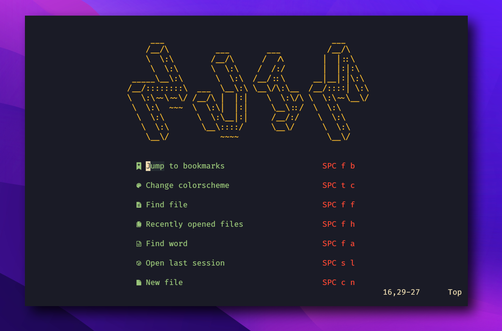
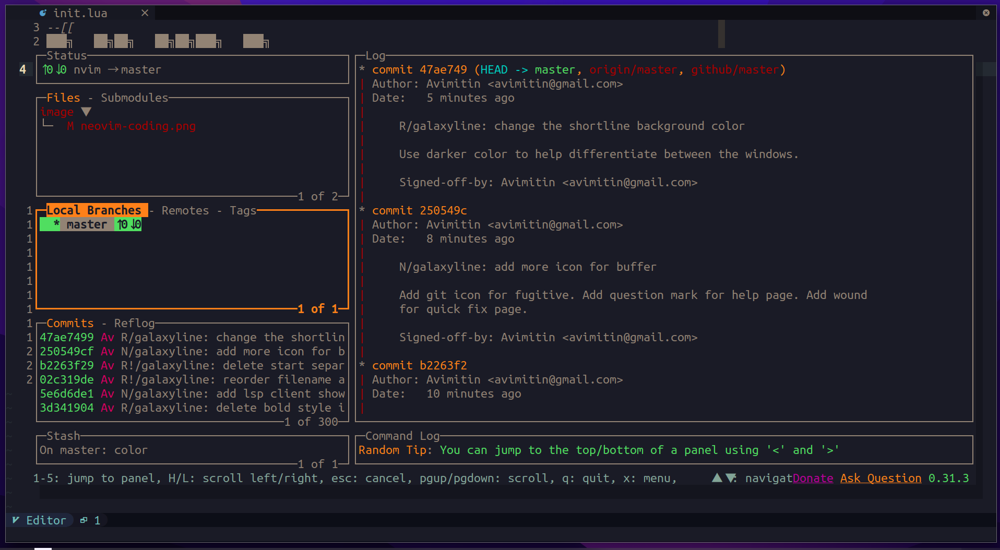

# My Neovim Configuration 



[](#more-screenshot)


## Guide

**[English](./README.md) (You are here)**
|
[中文](docs/README_CN.md)

> 中文文档因为我比较懒，所以不能保证完全同步，如果遇到
> 任何文档不对应的问题，请以英文版为准。

## Credit

This project is originally inspired by
[theniceboy/nvim](https://github.com/theniceboy/nvim).

And lua code is inspired by
[siduck76/NvChad](https://github.com/siduck76/NvChad).

Take a look at their contribution, which is really fantastic.

## Features

- Really fast! Start up in only 34ms! (See the bottom of the doc for the data)
- LSP support
- Completion like VSCode
- Tree file manager
- Symbols explorer
- Buffer line manager
- Fuzzy file/text/image finder
- Floating terminal and REPL support
- Handy git tools
- Motion on speed
- Markdown preview and snippet
- Optimized Rust, C++, Golang, Lua coding experience
- Configured most of the GUI: nvui, neovide, nvim-qt...

## Installation

To keep your customization, fork the configuration and clone
your repository URL instead of mine. Everyone should build their
own neovim configuration in my opinion.

```bash
# linux or mac user
git clone https://github.com/Avimitin/nvim ~/.config/nvim
```

Open your neovim by command `nvim` and wait for all plugins installed. Please
quit and reopen the neovim for loading all plugins.

**NOTE:** Markdown preview plugin is installed in another thread, please
wait for it until it response message of installation success. Otherwise, you will find
that you can't activate it.

### Docker

Just wanna have some fun but do not want to mess up your local environment?
I have docker script for you!

**THIS IS EXPERIMENTAL**

```bash
docker run -w /root -it --rm alpine:edge sh -uelic '
      apk add git neovim ripgrep alpine-sdk --update
      git clone https://github.com/Avimitin/nvim ~/.config/nvim
      nvim -c "autocmd User PackerComplete quitall"
      nvim /root/.config/nvim/README.md
  '
```

## Dependency

### Neovim (MUST)

> Currently I am using `NVIM v0.6.0-dev+501-gcb15055c2`. If you got any error,
> please check your neovim version.

- Follow [neovim installation](https://github.com/neovim/neovim/wiki/Installing-Neovim).
- Or if you are Arch Linux user: `yay -S neovim-git`

### Install nerdfont (MUST)

Most of my setting are based on nerd font. It's highly recommended to install
[nerdfont](https://www.nerdfonts.com/font-downloads) for impressive icon support.

### Surf (OPTIONAL)

I am using [Surf](https://surf.suckless.org/) as my markdown preview browser. Firefox
is too heavy for the preview job. If you have interest on it, please follow the instruction
from the official pages. If not, you can easily modify the settings:

```sh
sed -i 's/surf/firefox/g' ./lua/config/mkdp.lua
```

#### How to build surf

```sh
# Arch linux contains most of the library
# Other distro need to check out documents yourself
git clone https://git.suckless.org/surf
cd surf
sudo make clean install
```

### Check health

Open your neovim and input following command to check if the dependence is all installed or not.

```vim
:checkhealth
```
## Details about my configuration

See [addtional](./docs/addtional.md)

## License

MIT License

## Start up time test data

```text
# Open only buffer
# nvim --startuptime /tmp/nvim-startuptime && tail -n 1 /tmp/nvim-startuptime | awk -F: '{print $1}'
# test it 3 times
031.760  000.002
030.677  000.002
034.750  000.002

# Open README.md
# nvim README.md --startuptime /tmp/nvim-startuptime && tail -n 1 /tmp/nvim-startuptime | awk -F: '{print $1}'
093.170  000.002
092.512  000.003
090.087  000.002

# Open Rust file (which will trigger LSP server)
# nvim lib.rs --startuptime /tmp/nvim-startuptime && tail -n 1 /tmp/nvim-startuptime | awk -F: '{print $1}'
122.347  000.003
113.395  000.003
118.647  000.003
```

## More Screenshot


---

 

---



---


