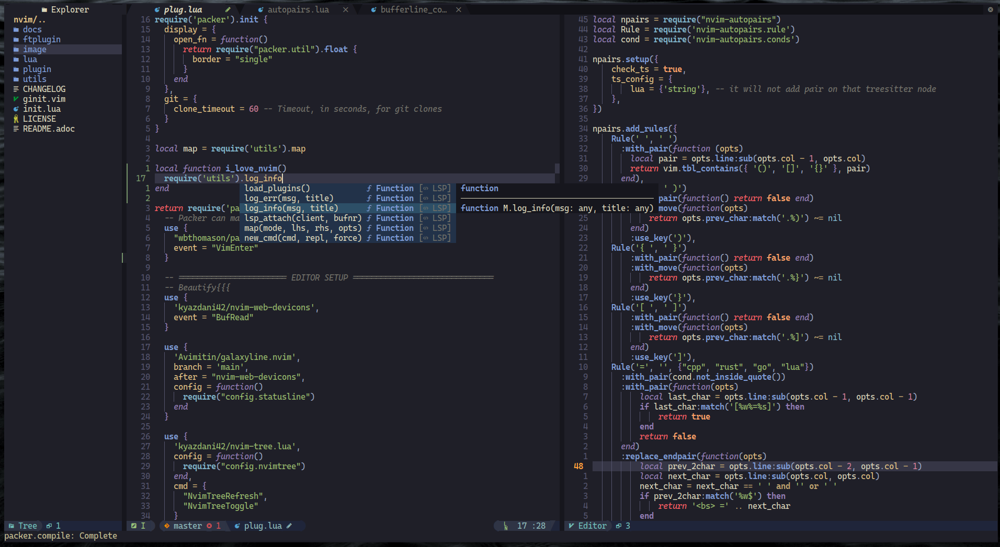
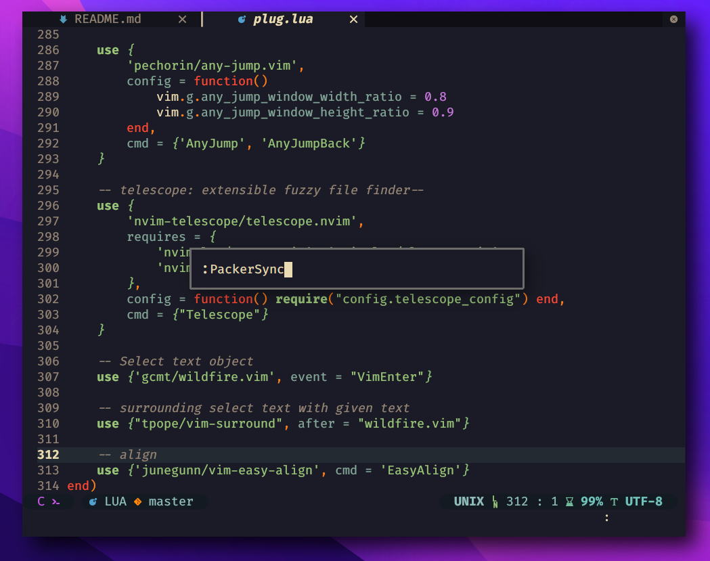
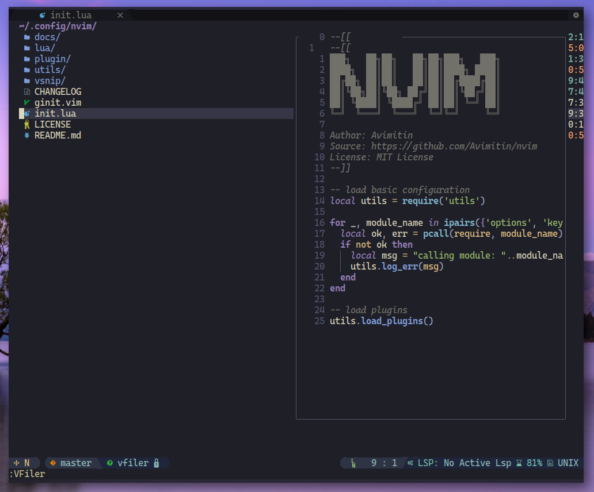
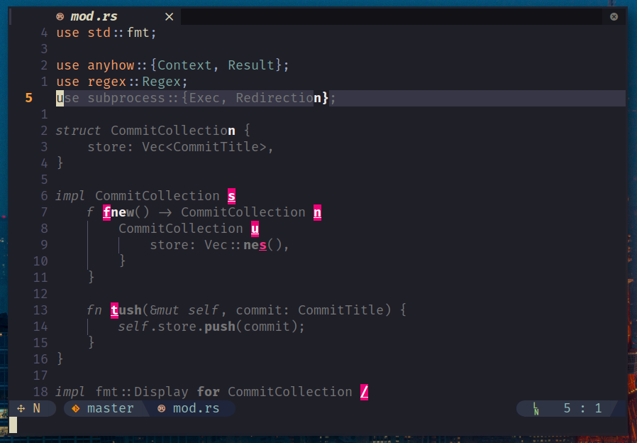
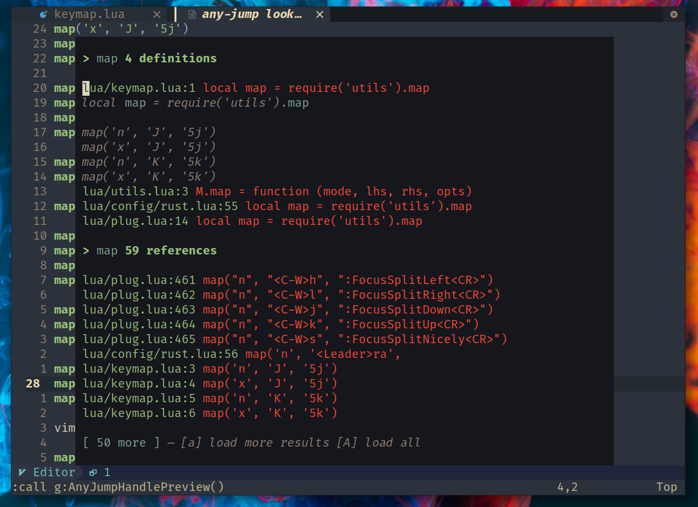
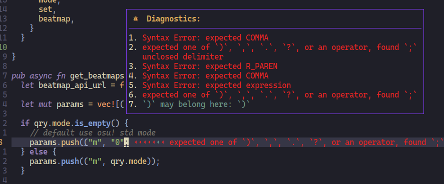
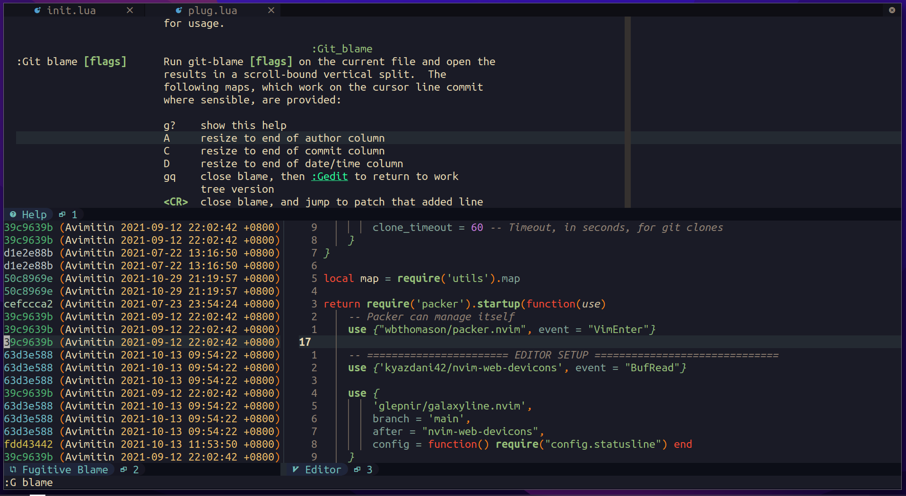
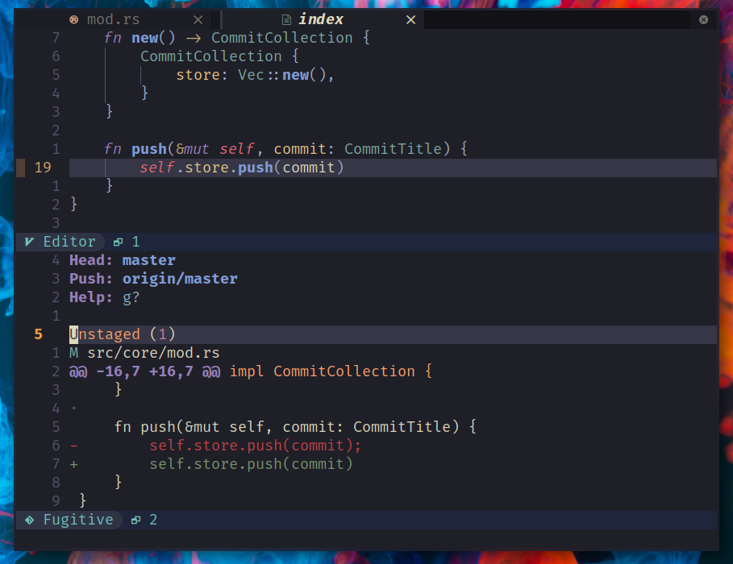
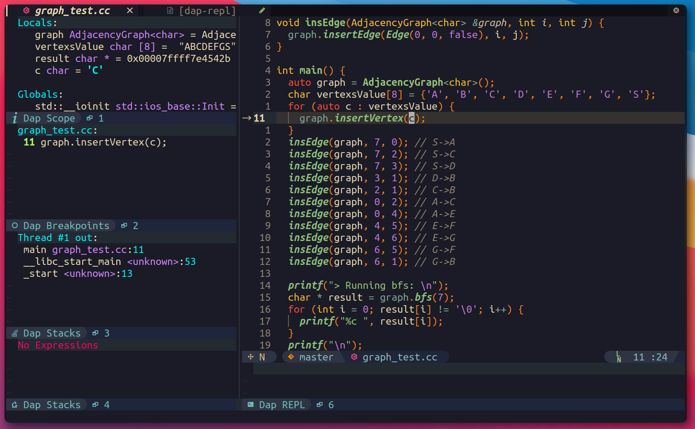

<h1 align="center">My Neovim Configuration</h1>


](https://img.shields.io/badge/More%20Screenshot-click-blueviolet?logo=googlephotos)


## Motivation

I want a text editor which:

* Really really fast. I don't need to care I will have to spend seconds or minutes on
opening a text file. (See link:./utils/benchmark.txt[`benchmark`])
* Really really powerful. I can use it to learn all the programming languages. I don't
need to install IDE per language.
* Really really handy. I don't need to move my hand to my mouse. I don't need to click
the keyboard too much. I can have my cursor in place at the moment my eye first skim.
* Really really beautiful. I can treat it as a work of art, not a tool.

## Getting Start

I recommend you use my configuration as a base and build your
configuration. In my opinion, everyone should have their customized
neovim. You can press the fork button to clone my project. (Don't forget
to smash the star button! `:)`)

Then, clone the repo:

```bash
git clone https://github.com/Avimitin/nvim.git ~/.config/nvim
```

You can read the full installation documentation here:
[*Installation Guide*](https://avimitin.github.io/nvim/en_us/installation.html)

<details>
  <summary>minimal vimrc</summary>
  <p>If you want a minimal vimrc, use this:<p>
  <pre>
# it is not tested yet, feel free to open issues

curl -SL "https://raw.githubusercontent.com/Avimitin/nvim/master/.vimrc" -o ~/.vimrc
  </pre>
</details>

## Details about my configuration

Please read [nvim book(WIP)](https://avimitin.github.io/nvim).

## License

MIT License

## Credit

The v0.1-v1.0-vimscript version is originally inspired by
[theniceboy/nvim](https://github.com/theniceboy/nvim).

And lua code since v2.0 is inspired by
[siduck76/NvChad](https://github.com/siduck76/NvChad).

Take a look at their contribution, which is really fantastic.

## Development Related

Please read [development specifications](./docs/src/en_us/development.md).

### More Screenshot

 

'''''



'''''


'''''



'''''



'''''



'''''



'''''




=== fugitive





=== Dap Debug

* CPP



* Rust


